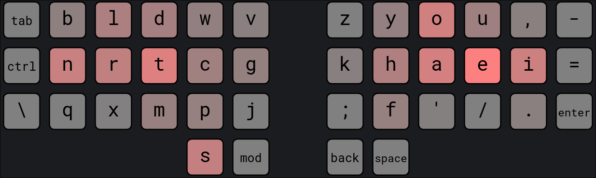

# Gallium SP - A thumb key layout
**Gallium SP** modifies the popular [Gallium](https://github.com/GalileoBlues/Gallium/) layout to reduce Same Finger Bigrams (SFBs) by 40% and Lateral Stretch Bigrams (LSBs) by 70% according to [this wonderful website](https://cyanophage.github.io/). 

This modification allows Gallium users to easily switch to a thumb key layout as there are only 5 letters that have moved position. This preserves most of the muscle memory you have already built.

While it is possible to move just two letters; `S` to the thumb and `P` to the vacant spot, I would recommend to rotate the `C P W` column to put the more common `C` on the home row.

## Strengths / weaknesses
This layout has all the same strengths and weaknesses as Gallium but with the additional advantages you get by putting a letter on the thumb key (fewer SFBs, reduced index finger usage).

A notable downside however is that `S` is one of the most common double letters and thumbs are not the fastest at double tapping.
## Statistics
The stats are also visible [here](https://cyanophage.github.io/playground.html?layout=bldwvzyou%2C-nrtcgkhaei%3Dqxmpj%3Bf%27%2F.%5Cs&mode=ergo&lan=english&thumb=l):
- SFBs: 0.37% (0.566% on [Oxey's layout playground](https://oxey.dev/playground/))
- Skip Bigrams (2U): 0.21%
- LSBs: 0.29%
- Ring/Pinky Scissors: 0.48%
